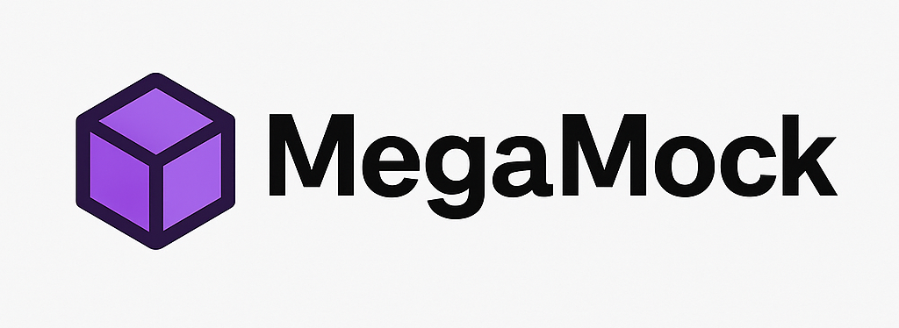

<p align="center">
  
</p>

# 🚀 MegaMock for NestJS

**MegaMock** is a declarative mock generator for NestJS.  
It creates mock API responses directly from class definitions using decorators — no json-server, no swagger mocker, no manual fixtures.

---

<p align="center">
  
  
  
</p>

---

## ✨ Features

- 🎯 Generate mock API responses via the `@MockRoute` decorator
- 🧩 Nested entities with `@MockProperty({ type: User })`
- 🔄 Array generation with random lengths
- ❓ Nullable fields with automatic probability
- 🧱 Depth limit to prevent circular structures
- 📦 Works with HTTP, WebSockets, tests, and local development
- 🔌 No external mock servers or JSON files required

---

## 📦 Installation

```bash
npm install @megamock/nest
# or
yarn add @megamock/nest
```

---

## 🚀 Quick Start

### 1. Create a mock DTO (not tied to ORM entities)

```ts
import { MockProperty } from '@svintsoff78/megamock';

export class UserMock {
  @MockProperty({ type: 'id' })
  id: number;

  @MockProperty({ type: 'string' })
  name: string;

  @MockProperty({ type: 'string', nullable: true })
  avatarUrl: string | null;
}
```

### 2. Nested mock entities and arrays

```ts
import { MockProperty } from '@svintsoff78/megamock';
import { UserMock } from './user.mock';

export class ChatMock {
  @MockProperty({ type: 'id' })
  id: number;

  @MockProperty({ type: 'title' })
  title: string;

  @MockProperty({
    type: UserMock,
    isArray: true,
    arrayLength: [2, 6],
  })
  participants: UserMock[];
}
```

### 3. Generate mock responses via @MockRoute

```ts
import { Controller, Get } from '@nestjs/common';
import { MockRoute } from '@megamock/nest';
import { ChatMock } from './chat.mock';

@Controller('chats')
export class ChatController {
  @Get()
  @MockRoute(ChatMock, { isArray: true, arrayLength: [3, 5] })
  findAll() {}

  @Get(':id')
  @MockRoute(ChatMock)
  findOne() {}
}
```

MegaMock will fully generate the response for these routes.

---

## ⚙️ MockRoute Options

```ts
@MockRoute(ChatMock, {
  isArray: true,
  arrayLength: [min, max]
})
```

| Option       | Description                                         | Required? |
|--------------|-----------------------------------------------------|-----------|
| `isArray`    | Generate a list of entities instead of a single one | `false`     |
| `arrayLength` | Random array length within the provided range       | `false`     |

## ⚙️ MockProperty Options

```ts
@MockProperty({ 
    type: 'string',
    nullable: true,
    isArray: true,
    arrayLength: [min, max]
})
```
| Option        | Description                                                | Required? |
|---------------|------------------------------------------------------------|-----------|
| `type`        | `string`, `number`, `boolean`, `uuid`, `date`, `Type<any>` | `true`    |
| `nullable`    | Can the property be nullable                               | `false`   |
| `isArray`     | Generate a list of entities instead of a single one        | `false`   |
| `arrayLength` | Random array length within the provided range              | `false`   |

--- 

## 🧠 Why MegaMock?

- ✔ Response types always match your DTOs
- ✔ No duplicated mock JSON files
- ✔ No external mock servers
- ✔ Great for frontend-backend parallel development
- ✔ Works natively with NestJS decorators and interceptors
- ✔ Consistent and predictable data generation

---

## 🗺 Roadmap

- 🔮 Faker integration (names, emails, lorem, addresses)
- ♻ Record mode (save real responses and replay them as mocks)
- 📚 Swagger examples autogeneration
- 🎛 Custom generators for advanced scenarios
- 🧬 Fine-grained rules for nested structures
- 🎨 Playground UI for inspecting mock outputs

---

## 🤝 Contributing

Contributions are welcome!
Open an issue or PR — let's build **MegaMock** together.

---

## 📄 License

MIT — free to use, modify, and distribute.

---

## ⭐ If MegaMock helps you — consider starring the repository!